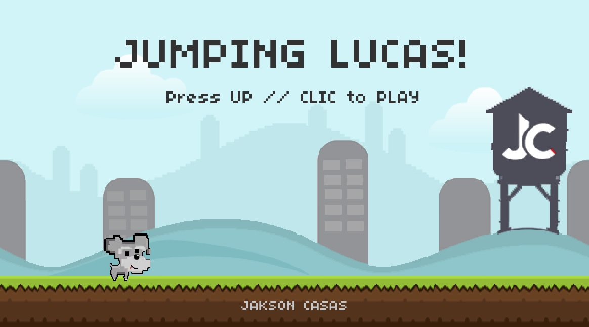
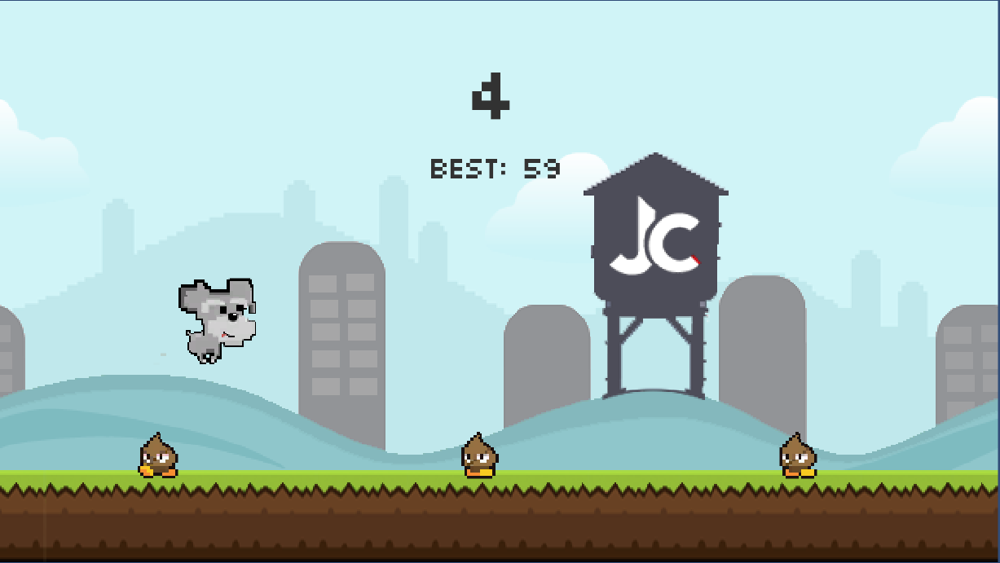
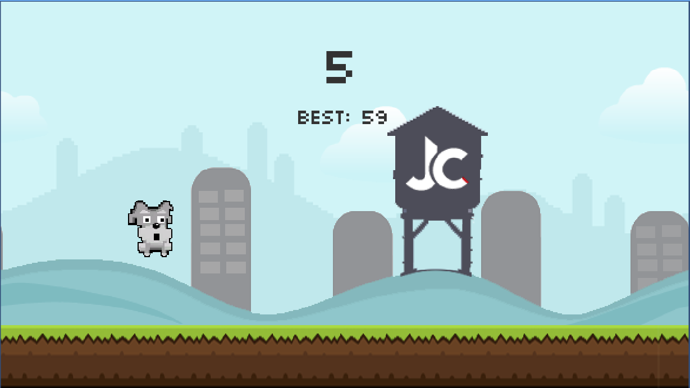

# JumpingLucasApp 🎮
Game developed in Unity

<h3 align="center"><strong>Note 01</strong></h3>
> Start the game

***

<h3 align="center"><strong>Note 02</strong></h3>
> Lucas you have to jump on the enemies, each time the level gets difficult when you reach level 20

***

<h3 align="center"><strong>Note 03</strong></h3>
> If Lucas runs into enemies, you lose the game and your points accumulate

***

